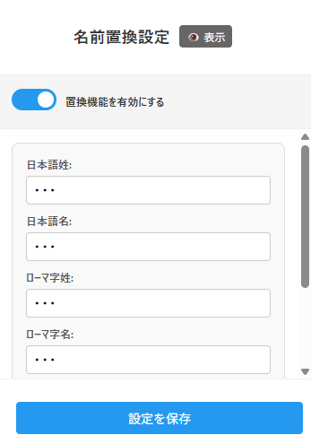
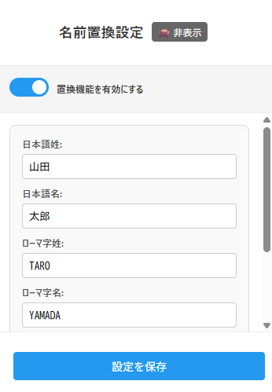

# Name Replacer Chrome Extension


Webページ上の名前を自動的に「***」に置き換えるChrome拡張機能です。プライバシー保護や画面共有時の個人情報漏洩防止に役立ちます。

## 機能

### ✨ 主要機能
- **リアルタイム名前置換**: Webページ上の指定した名前を「***」に自動置換
- **日本語・ローマ字対応**: 日本語名とローマ字名の両方に対応
- **姓名分離設定**: 姓と名を分けて設定可能
- **大文字小文字無視**: ローマ字名は大文字小文字を区別せずに置換
- **動的コンテンツ対応**: Ajax、React等で追加されるコンテンツにもリアルタイム対応
- **SPA完全対応**: GitHub等のSingle Page Applicationでのページ遷移に完全対応

### 🔒 プライバシー機能
- **設定画面での名前隠蔽**: 設定画面でも名前をパスワード形式で隠蔽
- **表示切り替え**: ワンクリックで名前の表示/非表示を切り替え
- **機能ON/OFF**: 拡張機能自体のON/OFF切り替え可能

### ⚡ パフォーマンス
- **瞬間置換**: ページ読み込み時の一瞬表示を防ぐ最適化済み
- **効率的監視**: MutationObserverによる効率的なDOM変更監視
- **軽量**: 必要最小限の権限で動作

### ⚠️ 表示についてのご注意
この拡張機能は、名前の漏洩を完全に防ぐため、**ページ全体を一時的に非表示にしてから名前置換処理を行い、その後表示する**仕組みを採用しています。

**体感的な影響:**
- ページの表示開始が0.1〜0.2秒程度遅く感じる場合があります
- 実際の読み込み時間はほぼ変わりません（処理は並行実行）
- 完全なプライバシー保護のための仕様です

**この仕組みにより:**
- 名前が一瞬も表示されることがありません
- Amazon等の高速動的サイトでも完全に保護されます
- GitHub等のSPAでのページ遷移時も確実に保護されます
- 画面共有やスクリーンショット時の事故を防げます

## インストール

### Chrome Web Store（未公開）
現在、Chrome Web Storeでの公開準備中です。

### 手動インストール
1. このリポジトリをダウンロードまたはクローン
```bash
git clone https://github.com/nft-syou/name-replacer-extension.git
```

2. Chromeの拡張機能管理画面を開く
   - Chrome設定 → 拡張機能
   - または `chrome://extensions/` にアクセス

3. デベロッパーモードを有効にする

4. 「パッケージ化されていない拡張機能を読み込む」をクリック

5. `name-replacer-extension` フォルダを選択

## 使用方法

### 初期設定
1. 拡張機能アイコンをクリックして設定画面を開く
2. 「置換機能を有効にする」がONになっていることを確認
3. 置換したい名前を登録：
   - **日本語姓**: 例）田中
   - **日本語名**: 例）太郎  
   - **ローマ字姓**: 例）Tanaka
   - **ローマ字名**: 例）Taro
4. 「名前を追加」ボタンで複数の名前セットを登録可能
5. 「設定を保存」をクリック

### 設定画面の機能
- **👁️ 表示 / 🙈 非表示**: 入力した名前の表示/非表示切り替え
- **置換機能ON/OFF**: スイッチで機能の有効/無効を切り替え
- **スクロール対応**: 多数の名前を登録してもスクロール可能

### 動作確認
設定保存後、Webページが自動リロードされ、指定した名前が「***」に置換されます。

## スクリーンショット

### 設定画面

**名前非表示状態（デフォルト）**



**名前表示状態（👁️表示ボタンクリック後）**



設定画面では、プライバシー保護のため名前はデフォルトで「***」として表示されます。「👁️ 表示」ボタンをクリックすることで、一時的に実際の名前を確認・編集できます。

## 対応サイト

- **静的サイト**: HTML、ブログ、ニュースサイト等
- **動的サイト**: Amazon、Twitter、Facebook、GitHub等のSPA
- **リアルタイムサイト**: チャット、ライブ配信等
- **全てのWebサイト**: `<all_urls>` 対応

## プライバシーとセキュリティ

### 権限
- `storage`: 設定データの保存（ローカルのみ）
- `activeTab`: 現在のタブへのアクセス（最小権限）

### データ保護
- 設定データはブラウザ内に保存（外部送信なし）
- 設定画面での名前隠蔽機能
- 機密情報やAPIキーは一切使用しない

## 技術仕様

- **Manifest Version**: 3
- **対応ブラウザ**: Chrome, Edge (Chromium系)
- **実行タイミング**: `document_start`（最速実行）
- **監視方式**: MutationObserver
- **CSS隠蔽**: `visibility: hidden` + `opacity: 0`

## ファイル構成

```
name-replacer-extension/
├── manifest.json       # 拡張機能設定
├── content.js          # メイン処理（名前置換）
├── content.css         # 隠蔽用CSS
├── popup.html          # 設定画面HTML
├── popup.js            # 設定画面ロジック
├── background.js       # バックグラウンド処理
└── README.md          # このファイル
```

## 開発・貢献

### 開発環境
```bash
# リポジトリクローン
git clone https://github.com/nft-syou/name-replacer-extension.git
cd name-replacer-extension

# 拡張機能をChromeに読み込み
# chrome://extensions/ でデベロッパーモードを有効にして読み込み
```

### 貢献方法
1. このリポジトリをフォーク
2. 機能ブランチを作成 (`git checkout -b feature/amazing-feature`)
3. 変更をコミット (`git commit -m 'Add amazing feature'`)
4. ブランチにプッシュ (`git push origin feature/amazing-feature`)
5. プルリクエストを作成

## トラブルシューティング

### よくある問題

**Q: 名前が置換されない**
- 設定画面で「置換機能を有効にする」がONになっているか確認
- 名前が正確に入力されているか確認
- ページをリロードしてみる

**Q: 一瞬名前が表示される**
- 拡張機能を再読み込みしてみる
- 他の拡張機能との競合がないか確認

**Q: GitHubでページ遷移時に画面が表示されない**
- 拡張機能を再読み込みしてみる
- コンソールでエラーが出ていないか確認
- ページを強制リロード（Ctrl+F5）してみる

**Q: 設定が保存されない**
- Chrome同期が有効になっているか確認
- ストレージ容量を確認

## ライセンス

このプロジェクトはMITライセンスの下で公開されています。詳細は [LICENSE](LICENSE) ファイルを参照してください。

## 作者

**nft-syou**
- GitHub: [@nft-syou](https://github.com/nft-syou)

## 更新履歴

### v1.0.0 (2025-01-13)
- 初回リリース
- 基本的な名前置換機能
- 日本語・ローマ字対応
- プライバシー保護機能
- 動的サイト対応
- SPA（Single Page Application）対応
- GitHubなどのページ遷移問題を解決
- autofocus競合の改善

---

⭐ このプロジェクトが役に立った場合は、スターをつけていただけると嬉しいです！